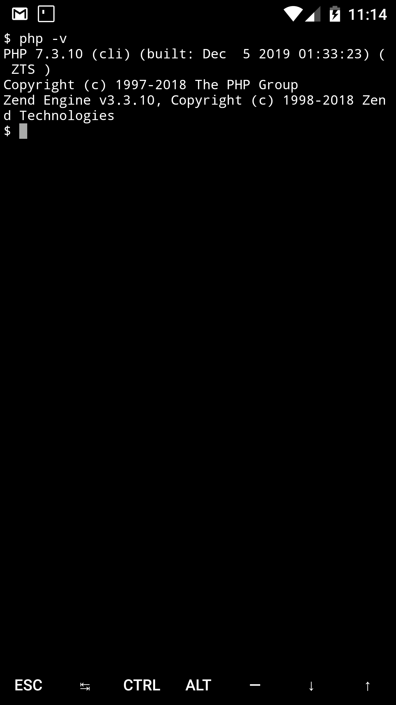
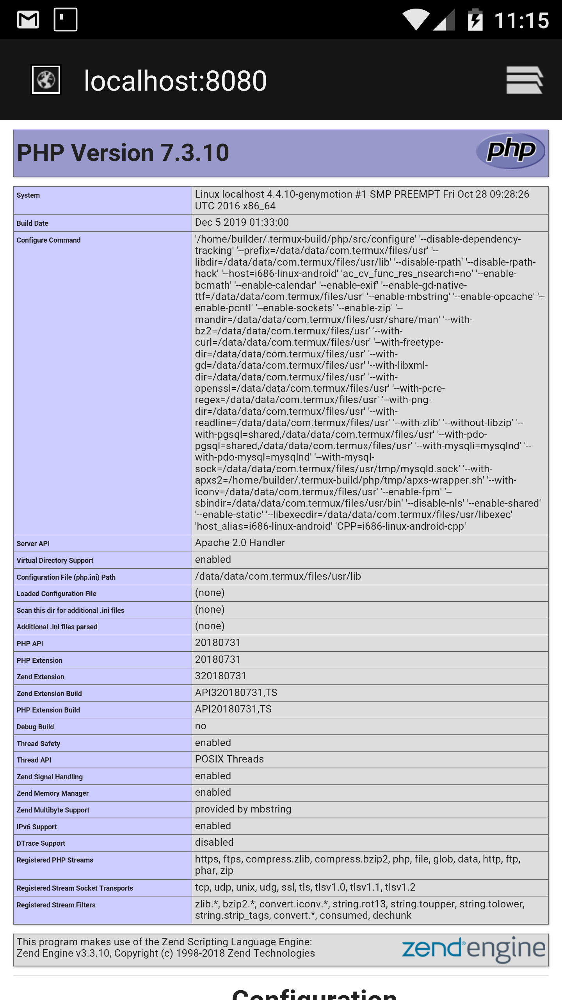

Repositori untuk setup PHP dan Apache2 di android menggunakan Termux.

## Instalasi
Untuk instalasi php dan apache2. Buka termux, lalu run command ini:

```
pkg install git -y && cd ~/ && git clone https://github.com/doublegunz/termux-php-apache2-setup.git && cd ~/termux-php-apache2-setup && bash setup && cd ~/ && rm -rf termux-php-apache2-setup
```

cek versi php:
```
php -v
```

Untuk menguji apakah PHP bisa  dirunning. Buat file index.php:
```
echo "<?php phpinfo();?>" > storage/shared/htdocs/index.php
```



start server:
```
apachectl
```

